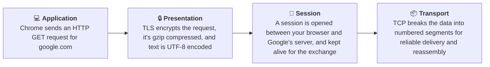
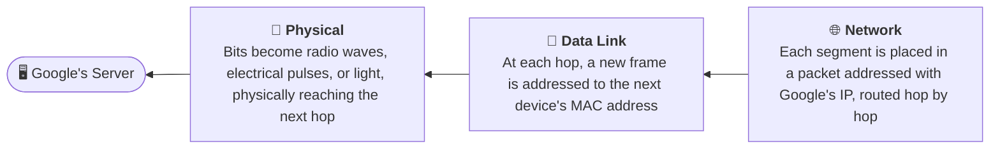

# OSI Model

The OSI Model is a logical and conceptual model that defines network communication used by systems open to interconnection and communication with other systems. The Open System Interconnection (OSI Model) also defines a logical network and effectively describes computer packet transfer by using various layers of protocols.

The OSI Model can be seen as a universal language for computer networking. It's based on the concept of splitting up a communication system into seven abstract layers, each one stacked upon the last.

## Why does the OSI model matter?

The Open System Interconnection (OSI) model has defined the common terminology used in networking discussions and documentation. This allows us to take a very complex communications process apart and evaluate its components.

While this model is not directly implemented in the TCP/IP networks that are most common today, it can still help us do so much more, such as:

- Make troubleshooting easier and help identify threats across the entire stack.
- Encourage hardware manufacturers to create networking products that can communicate with each other over the network.
- Essential for developing a security-first mindset.
- Separate a complex function into simpler components.

## Layers

The seven abstraction layers of the OSI model can be defined as follows, from top to bottom:


### Application

This is the only layer that directly interacts with data from the user. Software applications like web browsers and email clients rely on the application layer to initiate communication. But it should be made clear that client software applications are not part of the application layer, rather the application layer is responsible for the protocols and data manipulation that the software relies on to present meaningful data to the user. Application layer protocols include HTTP as well as SMTP.

### Presentation

The presentation layer is also called the Translation layer. The data from the application layer is extracted here and manipulated as per the required format to transmit over the network. The functions of the presentation layer are translation, encryption/decryption, and compression.

### Session

This is the layer responsible for opening and closing communication between the two devices. The time between when the communication is opened and closed is known as the session. The session layer ensures that the session stays open long enough to transfer all the data being exchanged, and then promptly closes the session in order to avoid wasting resources. The session layer also synchronizes data transfer with checkpoints.

### Transport

The transport layer (also known as layer 4) is responsible for end-to-end communication between the two devices. This includes taking data from the session layer and breaking it up into chunks called segments before sending it to the Network layer (layer 3). It is also responsible for reassembling the segments on the receiving device into data the session layer can consume.

### Network

The network layer is responsible for facilitating data transfer between two different networks. The network layer breaks up segments from the transport layer into smaller units, called packets, on the sender's device, and reassembles these packets on the receiving device. The network layer also finds the best physical path for the data to reach its destination this is known as routing. If the two devices communicating are on the same network, then the network layer is unnecessary.

### Data Link

The data link layer is very similar to the network layer, except the data link layer facilitates data transfer between two devices on the same network. The data link layer takes packets from the network layer and breaks them into smaller pieces called frames.

### Physical

This layer includes the physical equipment involved in the data transfer, such as the cables and switches. This is also the layer where the data gets converted into a bit stream, which is a string of 1s and 0s. The physical layer of both devices must also agree on a signal convention so that the 1s can be distinguished from the 0s on both devices.

## Encapsulation

As data moves down from the Application layer to the Physical layer, each layer wraps whatever it receives from the layer above with its own header, without looking inside or modifying what's already there, like nesting envelopes inside envelopes. This process is called **encapsulation**.

1. **Application** creates the actual data (e.g. the HTTP request text).
2. **Presentation** encrypts it (TLS) and compresses it (gzip).
3. **Session** manages the connection state.
4. **Transport** breaks the data into segments and adds a **TCP header** to each one (source/destination port, sequence number).
5. **Network** wraps each segment in a packet and adds an **IP header** (source/destination IP).
6. **Data Link** wraps each packet in a frame and adds a **MAC header** (source/destination MAC address).
7. **Physical** converts the finished frame into raw bits, sent as electrical, radio, or light signals.

The reverse process, where the receiving device strips off each header layer by layer as data moves back up the stack from Physical to Application, is called **decapsulation**.

## Example: Loading google.com

Here's how a single request travels down through all seven layers, using Chrome loading `google.com` as a running example:



<div class="diagram-connector" markdown="1">
<svg width="16" height="36" viewbox="0 0 16 36" xmlns="http://www.w3.org/2000/svg">
  <line x1="8" y1="0" x2="8" y2="26" stroke-width="1.5" />
  <path d="M8 34 L2.5 24 L13.5 24 Z" stroke="none" />
</svg>
</div>



- **Application**: Chrome sends a [GET request](../chapter-3/rest-graphql-grpc.md) using HTTP, the standardized protocol that defines how to ask for a page and interpret the response. Chrome itself is just the software that calls into HTTP; the protocol, not the app, is what's part of the OSI model.
- **Presentation**: [TLS](../chapter-4/ssl-tls-mtls.md) handles encryption, gzip handles compression, and UTF-8 handles translation, all before the request ever reaches the network.
- **Session**: this connection stays open for as long as the exchange needs, then closes once the page finishes loading.
- **Transport**: if a [TCP](tcp-and-udp.md) segment is lost in transit, only that segment is resent, not the whole page.
- **Network**: the destination [IP address](ip.md) stays the same for the entire journey; your packet carries your private IP only until it hits your router, which swaps it for your public IP via NAT.
- **Data Link**: unlike the IP address, the MAC address changes at every hop, since it's only responsible for the next physical jump.
- **Physical**: the actual medium changes along the way too, WiFi radio at home, possibly Ethernet, and fiber optic light pulses across the internet's backbone.

??? note "Behind the scenes: what's actually being sent, layer by layer"
    **Application** — the raw [HTTP request](../chapter-3/rest-graphql-grpc.md) Chrome sends, in plaintext:

    ```
    GET / HTTP/1.1
    Host: www.google.com
    User-Agent: Mozilla/5.0
    Accept: text/html
    Connection: keep-alive
    ```

    **Presentation** — once [TLS](../chapter-4/ssl-tls-mtls.md) encrypts it, that readable text becomes opaque ciphertext, roughly:

    ```
    16 03 03 00 c2 01 00 00 be 03 03 6d 1f e4 a2 ...
    ```

    **Session** — the `Connection: keep-alive` header above is what tells the session layer to hold the connection open instead of closing it after one exchange, so the next request can reuse it.

    **Transport** — a [TCP](tcp-and-udp.md) segment header, with the fields actually used to sequence and reassemble data:

    ```
    Source Port: 51342        Destination Port: 443
    Sequence Number: 1461247570
    Flags: [SYN, ACK]
    ```

    **Network** — an [IP](ip.md) packet header, wrapping that segment:

    ```
    Source IP: 192.168.1.24
    Destination IP: 142.250.72.14
    TTL: 64                   Protocol: TCP
    ```

    **Data Link** — an Ethernet frame header, wrapping that packet for the next hop only:

    ```
    Destination MAC: 3C:A6:2F:11:9B:04   (your router)
    Source MAC:      A4:5E:60:D2:7C:91   (your laptop)
    EtherType: 0x0800 (IPv4)
    ```

    **Physical** — all of the above, ultimately, is just a stream of bits:

    ```
    01000111 01000101 01010100 00100000 2f 20 48 54 54 50 ...
    ```

    turned into radio waves, voltage pulses, or light, depending on the medium.

## Practice Questions

Test yourself. Click a question to reveal the answer.

??? question "1. What protocol does Chrome actually use to send a GET request to a web server, and which OSI layer does that protocol belong to? (Chrome itself isn't part of the OSI model, only the protocol it uses is.)"
    HTTP, the Application layer protocol. This is distinct from TLS, which handles encryption at the Presentation layer — together they make up HTTPS.

??? question "2. What specific problem does the Session layer solve that HTTP alone doesn't handle?"
    HTTP is stateless, each request is independent with no memory of previous ones. The Session layer keeps a connection open and maintains that continuity, so state like being logged in persists across multiple exchanges.

??? question "3. If a Transport-layer segment gets lost on its way to the server, what actually happens, and which protocol is responsible for that behavior?"
    Only that specific segment gets resent, not the whole page, because segments are numbered so the receiver can detect exactly which one is missing. TCP is the protocol responsible.

??? question "4. Across a multi-hop journey, one address (IP or MAC) stays constant and one changes at every hop. Which is which, and why?"
    The destination IP stays constant for the entire trip. The MAC address, both source and destination, changes at every hop, because Data Link addressing only has local scope, it's only responsible for the next physical jump, not the whole journey. Your own source IP does change once, via NAT at your router, but not at every hop like MAC.

??? question "5. Once a Data Link frame is built, it still has to physically reach the next device. What layer handles that, and what are some physical mediums it might travel through?"
    The Physical layer. Depending on the medium: radio waves (WiFi), electrical voltage pulses (Ethernet cable), or light pulses (fiber optic backbone).

??? question "6. What's the difference between how a Layer 4 load balancer and a Layer 7 load balancer make their routing decisions?"
    A Layer 4 (Transport) load balancer routes based only on IP address and port, without inspecting the actual data, making it fast but simple. A Layer 7 (Application) load balancer reads the actual HTTP request (URL path, headers, cookies) to make smarter, content-aware routing decisions, at the cost of more overhead.

??? question "7. What is the process called where each layer wraps the data from the layer above with its own header as it moves down the stack? What's the reverse process called?"
    Encapsulation, going down from Application to Physical. The reverse, stripping headers back off going up from Physical to Application on the receiving end, is called decapsulation.

??? question "8. You can successfully ping a server, but loading a webpage from it just times out. Which layers are confirmed working, and what's the most likely culprit?"
    Physical, Data Link, and Network are confirmed working, since ping's ICMP is a Network-layer protocol, and a successful round trip proves the lower layers work too. The most likely culprit is a blocked port at the Transport layer (firewalls often allow ICMP but block TCP 80/443), or the web server process itself not running at the Application layer. Ping succeeding only proves basic network reachability, not that any specific service or port is actually open and listening.
